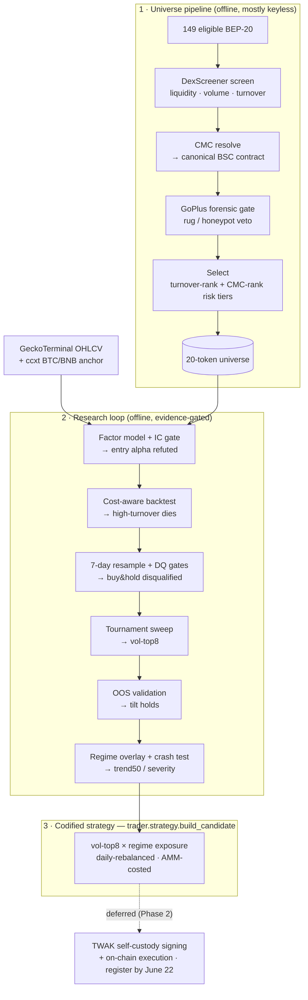
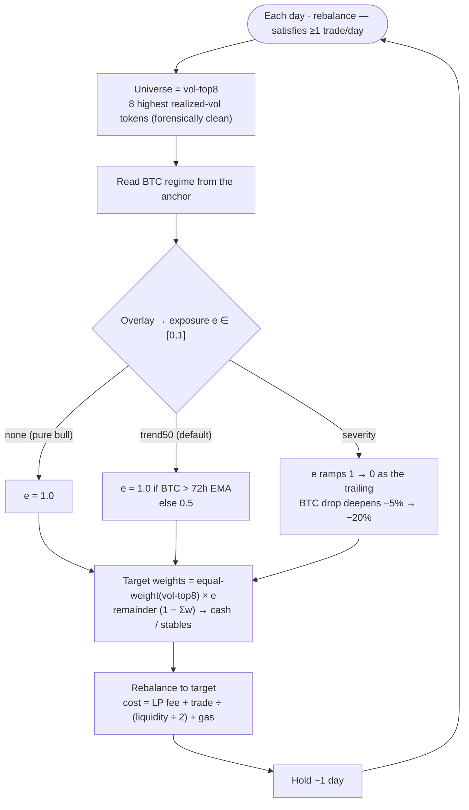
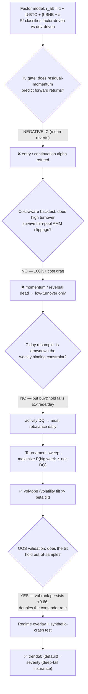

# Strategy Logic — visual map

A visual summary of the logic developed for the [[Project Overview|agent]]: the offline
**universe pipeline**, the **research loop** that produced (and gated) the strategy, the
**runtime decision logic** of the codified candidate, and the **regime overlay**. Diagrams are
Mermaid (render in Obsidian). Detail lives in [[Trading Strategies]], [[Token Universe]],
[[Simulated Market]], and the [[Build Log]].

## 1 · End-to-end system

## 2 · Runtime decision logic (what the agent does each day)

### Overlay exposure — the three gates

| Overlay | Exposure rule | Keeps | Insures |
|---|---|---|---|
| `none` | always 1.0 | max upside | nothing (blows the gate in any crash) |
| **`trend50`** (default) | 1.0 above 72h EMA, else 0.5 | moderate upside | moderate / sharp crashes (DQ→0) |
| `severity` | 1 → 0 as trailing drop −5%→−20% | ~full upside (dormant in calm) | the **deep slow crash** tail (survives −50%) |

## 3 · Research loop — how each finding gated the strategy

> **Read it as:** every box is a question the data answered, and most answers were *negative* —
> entry alpha refuted, high-turnover killed by costs, buy&hold disqualified — which is what
> shaped the survivor: **a daily-rebalanced, volatility-tilted, regime-gated low-turnover book.**
> The honest no's mattered as much as the yes's.

## Legend

- **vol-top8** — the 8 highest-realized-volatility eligible tokens, equal-weighted.
- **TOURNEY** — P(weekly return > +15% **and** not disqualified) — the leaderboard objective.
- **DQ gates** — drawdown > 30% **or** < 1 trade/day. Both disqualify.
- **AMM cost** — constant-product price impact ≈ trade ÷ (liquidity ÷ 2) + LP fee + gas.
